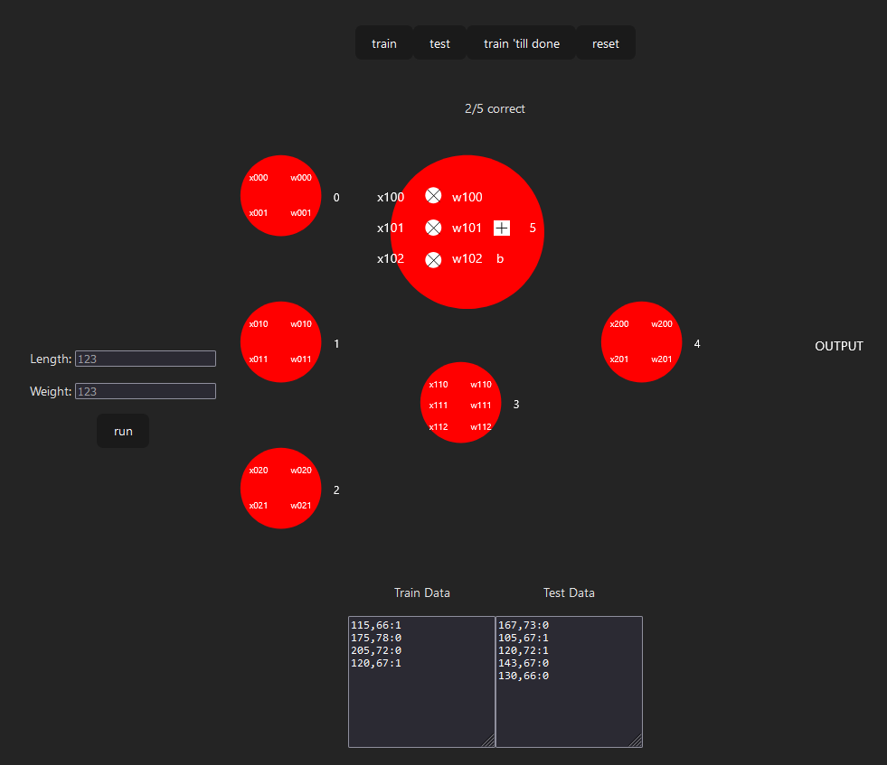

# A minimal neural network in Scala JS


## Buliding and Developing
This project was initially built by following the [scala.js documentation](https://www.scala-js.org/doc/tutorial/scalajs-vite.html), and is a very good source if you have any problems with the code itself.
### Prerequsites
- [Scala and its development tools](https://www.scala-lang.org/download/)
  - This project uses scala 3.3.4 and sbt 1.8.2
- [Node.js](https://nodejs.org/en/download/package-manager)
  - This project was built using node v20.4.0

The following commands lets you check your versions after having followed the installatioin instructions above. The version numbers do not necessarily need to be the exact same, but there are no guarantess it will work.

```bash
$ node -v
v20.4.0
$ npm -v
9.7.2
$ sbt -version
sbt version in this project: 1.8.2
sbt script version: 1.9.1
```

### Developing
Whilst you develop, to get live changes with vite, you need to run ```npm run dev``` in the project folder, which will both host the website and refresh to show any changes

To have the scala code changes be reflected on the localhost, one needs to run the following code in the same peoject folder, but in another terminal window:
```bash
$ sbt
[...]
sbt:vscAi> ~fastLinkJS
```
### Building
To build the project, one only needs to run ```npm run build```, which will generate the right html-, js-, and css files in the ```.dist``` folder.

## Description
This is a project based on [Björn Regnells Ai talk](https://github.com/bjornregnell/scai), where he uses scala to demonstare the very basic fundamentals of machine learning. This project takes that code, and tries to visually show what is happening in the neural network, to achieve a more dynamic and interactive experience



### Buttons
#### Train
The training button will use the training data below to run the training algorithm for a total of 50 cycles, updating the weights and biases
#### Test
The test button will use the test data below to test the performance of the network. The outputs and inputs of the network are updated, and a message will appear telling you how many of the tests were correctly predicted by the network
#### Train 'till done
The train 'till done button will use the same methods as the train button, but instead of only 50 cycles, it will run until the network predicts correctly on all od the test data
#### Reset
The reset button will simply reset the network to its initial state, making it possible to retrain the network with different datasets
#### Run
This button will take the given inputs of length and weight, and lets the network predict the gender of said person.
### Network
The network is a small network with 3 layers, in a 3-2-1 node configuration. The nodes themselves show their values: the inputs on the left side; the weights on the inner right side; and the output on the outer right side.
The last node also has a output field further to the right of it, which will divulge the network prediciton when clcking the run button.

One node, the upper middle one, is slighty larger and contains more information about what is going on inside. This is to give a more thurough look at the mathemathics of the network, without overwheling the user by showing this on every node.

### Inputs
There are 2 primary inputs: the single run prediction and the datasets
### Single run
The the left there are two input fields for length and weight. When clicking the run button, these values are inserted into the network, and values will propagate through the network until a prediction is amde on the far right side.

### Datasets
At the bottom on can customize the datasets that are used to train and test the network. Each entry need to be in the format of ```length,weight:gender```, where length and weight are any 3 digit values, and gender is (for this project it is binary for simplicitys sake) either 0 for male, and 1 for female